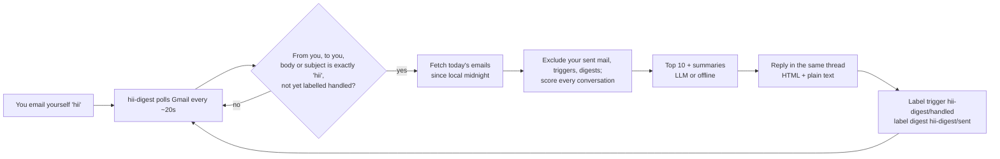
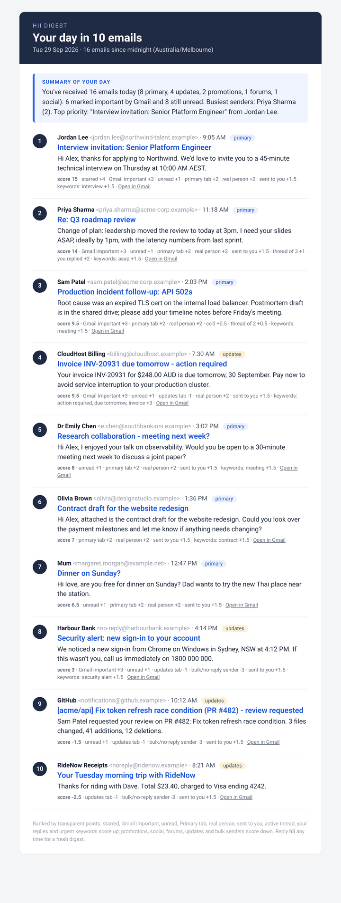

# gmail-hii-digest

Email yourself **`hii`** and get a reply in the same thread with a summary of your day: the
**10 most important emails you received today**. Each entry shows the sender, subject, time, a
one-to-two line summary and a Gmail link, and there's a short summary of the whole day at the top.
Every entry also lists its **score and the reasons behind it**, so you can see how it was ranked.

- Runs on your own laptop (macOS or Windows, Python 3.10+) and uses the official Gmail API with your own OAuth client.
- Works with no AI at all. If you set `OPENAI_API_KEY`, an LLM writes the summaries instead, and it falls back to the offline summaries if the LLM call fails.
- Answers each `hii` exactly once, even after a restart, and never replies to its own digests.



<p align="center"><br>
<em>Sample digest from <code>python -m hii_digest preview --demo</code> (made-up data)</em></p>

---

## Contents

1. [Google Cloud setup (one time, about 10 minutes)](#1-google-cloud-setup-one-time-about-10-minutes)
2. [Install](#2-install)
3. [First sign-in](#3-first-sign-in)
4. [Run it](#4-run-it)
5. [Demo script for a screen recording](#5-demo-script-for-a-screen-recording)
6. [How ranking works](#6-how-ranking-works)
7. [Configuration reference](#7-configuration-reference)
8. [Troubleshooting](#8-troubleshooting)
9. [Privacy](#9-privacy)
10. [Development](#10-development)

---

## 1. Google Cloud setup (one time, about 10 minutes)

You create your own small Google Cloud project, so the app only ever talks to Google on your behalf.
Google's console changes its labels from time to time. The steps below match the current
"Google Auth Platform" layout, and older layouts have the same options under
*APIs & Services → OAuth consent screen*.

1. **Create a project.** Open <https://console.cloud.google.com/>, click the project picker at the top, then
   **New project**. Name it something like `hii-digest` and click **Create**. Make sure it's selected.
2. **Enable the Gmail API.** Go to **APIs & Services → Library**, search for **Gmail API**, open it and click **Enable**.
3. **Configure the OAuth consent screen.** Go to **APIs & Services → OAuth consent screen**, which opens *Google Auth Platform*, and click **Get started**:
   - *App information*: App name `hii digest`, and choose your own Gmail as the user support email.
   - *Audience*: choose **External**.
   - *Contact information*: your email. Accept the policy and click **Create**.
4. **Add yourself as a test user.** In **Google Auth Platform → Audience**, leave the publishing status on
   **Testing**. Under **Test users** click **Add users**, enter your Gmail address (the one you'll use
   with the app) and click **Save**. Only listed test users can sign in to an app in Testing mode.
5. *(Optional)* **Data access → Add or remove scopes**: add `.../auth/gmail.modify` and `.../auth/gmail.send`.
   You can skip this in Testing mode because the app asks for these scopes when you sign in.
6. **Create a Desktop OAuth client.** Go to **Google Auth Platform → Clients → Create client**. Pick
   **Application type: Desktop app**, name it `hii-digest desktop`, then click **Create**.
7. **Download the JSON.** Click **Download JSON** in the dialog, or use the download icon next to the client. Rename the file to
   **`credentials.json`** and put it in the **root of this repository folder**, next to `README.md`.

> `credentials.json` and the `token.json` created later are listed in `.gitignore`, so they are never committed.

## 2. Install

You need Python 3.10 or newer. Check with `python3 --version` on macOS or `py --version` on Windows.

**macOS / Linux**

```bash
git clone https://github.com/Otto-Deviant1904/gmail-hii-digest.git
cd gmail-hii-digest
python3 -m venv .venv
source .venv/bin/activate
pip install -r requirements.txt
cp .env.example .env          # optional: edit settings
```

**Windows (PowerShell)**

```powershell
git clone https://github.com/Otto-Deviant1904/gmail-hii-digest.git
cd gmail-hii-digest
py -m venv .venv
.venv\Scripts\Activate.ps1    # if blocked: Set-ExecutionPolicy -Scope CurrentUser RemoteSigned
pip install -r requirements.txt
copy .env.example .env        # optional: edit settings
```

(In Windows *cmd.exe*, activate with `.venv\Scripts\activate.bat`.)

Check the install without any Google setup. This prints a sample digest made from fake emails and
writes an HTML file under `previews/`:

```bash
python -m hii_digest preview --demo
```

## 3. First sign-in

```bash
python -m hii_digest auth
```

Your browser opens the Google sign-in page:

1. Choose the Gmail account you added as a **test user**.
2. You'll see **"Google hasn't verified this app"**. That's expected for your own app in Testing mode.
   Click **Continue**. Depending on the screen, you may need to open **Advanced** first and then click **Go to hii digest (unsafe)**.
3. Allow the requested permissions. **Tick every checkbox** if Google shows checkboxes.
4. The terminal prints `Authorised as you@gmail.com`, and `token.json` is saved in this folder.

The app detects your address from the signed-in account, so there's nothing to configure.

## 4. Run it

| Command | What it does |
|---|---|
| `python -m hii_digest run` | Watches Gmail and replies to each new `hii`. Checks every 20 s and logs every check. Stop with **Ctrl+C**. |
| `python -m hii_digest run --interval 10` | Same as `run`, but checks every 10 seconds. |
| `python -m hii_digest run --only-new` | Ignores `hii` emails that arrived before this run started. |
| `python -m hii_digest once` | Checks once, replies to any pending `hii`, then exits. |
| `python -m hii_digest preview` | Builds today's real digest from Gmail, writes `previews/digest-*.html` and prints the text. **Sends nothing and changes nothing in Gmail.** |
| `python -m hii_digest preview --demo` | Same preview, but with built-in fake emails. No Google account needed. |
| `python -m hii_digest preview --no-llm` | Preview without the LLM even if `OPENAI_API_KEY` is set. |
| `python -m hii_digest -v run` | Debug logging, which also explains why a self-email was *not* treated as a trigger. |

(Optional) `pip install -e .` adds a `hii-digest` command, so `hii-digest run` works too.

A trigger is an email **from you, to you**, received in the last 24 hours (configurable), whose
**subject or body** is exactly the trigger word. Case, surrounding whitespace, your signature,
"Sent from my iPhone" and quoted reply text are ignored. For example, `Hii` counts, and so does
`hii` followed by your email signature. `hii there` and `hi` don't count.

## 5. Demo script for a screen recording

Before recording, sign in once (step 3) and run `python -m hii_digest preview` to check that
everything works. Keep the terminal and Gmail side by side.

1. **Start the watcher.** In the terminal:
   ```bash
   python -m hii_digest run --only-new
   ```
   You'll see `Watching you@gmail.com for 'hii' every 20s ...` and a timestamped
   `Checked inbox: no new 'hii' emails` line every ~20 seconds.
   (`--only-new` means test `hii` emails you sent earlier today won't be answered on camera.)
2. **Send "hii" to yourself from Gmail.** Click **Compose**, put your own address in **To**, write **`hii`** as the subject
   and **`hii`** as the body, then click **Send**. Using `hii` for both gives the neatest `Re: hii` thread.
3. **Watch the log pick it up**, usually within about 20 seconds:
   ```
   2026-09-29 17:44:12  INFO    Found 1 new 'hii' email(s) - building digest
   2026-09-29 17:44:14  INFO    Built digest: 37 emails today in 29 conversations, top 10 chosen, summaries=offline
   2026-09-29 17:44:15  INFO    Sent digest (10 emails, offline summaries) in reply to 19a3... received 17:44:03
   ```
4. **Open the reply.** In Gmail, the `hii` conversation now contains the digest. It has a header with the date and
   email count, a summary of the day, and 10 ranked entries. Click a subject or **Open in Gmail** to jump to
   that email.
5. **Explain the ranking.** Under each entry, the small grey line shows its score and the reasons behind it, for example
   `score 14 · Gmail important +3 · unread +1 · primary tab +2 · real person +2 · sent to you +1.5 · thread of 3 +1 · you replied +2 · keywords: asap +1.5`.
   Point out that people you deal with, Gmail-important mail and urgent keywords score up, while
   promotions, social notifications and no-reply senders score down. The weights are listed in
   [How ranking works](#6-how-ranking-works).
6. *(Optional)* Send `hii` again to get a fresh digest. The first `hii` now has the label `hii-digest/handled` and won't be answered twice.
   Stop the watcher with **Ctrl+C**, which prints `Stopped. Bye!`.

## 6. How ranking works

Ranking lives in [`hii_digest/scoring.py`](hii_digest/scoring.py) and is deliberately simple and
transparent. Each email starts at 0 and gets points for each signal:

| Signal | Points | Notes |
|---|---:|---|
| Starred | +4.0 | Gmail `STARRED` |
| Gmail "important" | +3.0 | Gmail's own importance marker |
| Unread | +1.0 | |
| Primary tab | +2.0 | `CATEGORY_PERSONAL` or no category |
| Updates tab | −1.0 | mild penalty (receipts, notifications) |
| Forums tab | −2.0 | |
| Social tab | −3.0 | |
| Promotions tab | −4.0 | |
| Real person | +2.0 | not a bulk sender |
| Bulk / no-reply sender | −3.0 | `List-Unsubscribe`, `List-Id`, `Precedence: bulk`, `Auto-Submitted`, or `noreply@`-style address |
| Sent directly to you | +1.5 | you're in `To` |
| CC'd | +0.5 | you're only in `Cc` |
| Not addressed to you | −1.0 | BCC or mailing list |
| Active thread | +0.5 per extra message | max +2.0 |
| You replied in the thread | +2.0 | |
| Urgency keywords | +1.5 each | max +3.0. Keywords: urgent, asap, deadline, action required/needed, time-sensitive, overdue, due today/tomorrow, invoice, payment due, interview, offer, contract, meeting, reschedule, security alert, final notice |

- **One entry per conversation.** The digest shows the latest message you received today in each thread.
- **Always excluded:** your own sent mail, `hii` triggers, previous digests, drafts, chats, spam and trash.
- **Ties** go to the most recent email. If fewer than 10 emails qualify, the digest says so.
- To tune the weights, edit the `Weights` dataclass. The tests in `tests/test_scoring.py` document the expected behaviour.

## 7. Configuration reference

All settings are optional. Put them in `.env`, starting from `.env.example`, or set them as environment variables. Real environment variables override `.env`.

| Variable | Default | Meaning |
|---|---|---|
| `HII_TRIGGER_WORD` | `hii` | Word that triggers a digest (one word, case-insensitive) |
| `HII_TIMEZONE` | `Australia/Melbourne` | IANA timezone that defines "today" (since local midnight) and the times shown |
| `HII_POLL_INTERVAL` | `20` | Seconds between checks in `run` mode (`--interval` overrides) |
| `HII_TOP_N` | `10` | Number of emails in the digest |
| `HII_TRIGGER_LOOKBACK_HOURS` | `24` | Only answer triggers received within this many hours |
| `HII_MAX_CANDIDATES` | `150` | Maximum number of today's messages fetched and scored |
| `HII_MAX_TRIGGERS` | `25` | Maximum number of candidate trigger emails inspected per check |
| `HII_CREDENTIALS_FILE` | `credentials.json` | OAuth client file from Google Cloud |
| `HII_TOKEN_FILE` | `token.json` | Cached sign-in token (created by `auth`) |
| `HII_HANDLED_LABEL` | `hii-digest/handled` | Label put on answered triggers (created automatically) |
| `HII_DIGEST_LABEL` | `hii-digest/sent` | Label put on digests the app sends (created automatically) |
| `HII_LOG_LEVEL` | `INFO` | `DEBUG`, `INFO`, `WARNING` or `ERROR` |
| `OPENAI_API_KEY` | *(empty)* | If set, an LLM writes the per-email lines and the day summary |
| `OPENAI_BASE_URL` | `https://api.openai.com/v1` | Any OpenAI-compatible endpoint (Azure/OpenRouter/local proxy, etc.) |
| `OPENAI_MODEL` | `gpt-4.1-mini` | Chat model name. Pick any cheap, fast model your endpoint offers |
| `HII_LLM_TIMEOUT` | `30` | Seconds before the LLM call is abandoned and offline summaries are used |

**Permissions (OAuth scopes):** `gmail.modify` lets the app read mail and add labels, and `gmail.send` lets it send
the reply. `gmail.modify` cannot permanently delete mail, and this app never archives, trashes, deletes or marks mail as read.

## 8. Troubleshooting

| Problem | Fix |
|---|---|
| **`Error 403: access_denied`** when signing in | The account isn't a test user. Add it under Google Auth Platform → Audience → **Test users** (step 4), and make sure you picked the same account in the browser. |
| **"Google hasn't verified this app"** | Expected for a personal app in Testing mode. Click **Continue**, or **Advanced → Go to hii digest (unsafe)**. |
| **`credentials.json not found`** | Download the **Desktop app** client JSON (step 7) into the repo folder and name it exactly `credentials.json`. |
| **Token expired / revoked** (`invalid_grant`, "Delete token.json…") | Google expires tokens for Testing-mode apps after **7 days**. Delete `token.json` and run `python -m hii_digest auth` again. Do the same if you changed scopes or Google accounts. |
| **"missing Gmail permissions"** | You unticked a checkbox on the consent screen. Delete `token.json`, run `auth` again and tick every box. |
| **Nothing happens when I send hii** | (1) Is `run` still running? It logs a line every check. (2) The subject or body must be **exactly** `hii`, so `hii!` or `hii there` won't match. Run with `-v` to see why a self-email was ignored. (3) Send it **to your own address** from the **same account** you authorised. (4) Gmail can take a few seconds to index a new email, so wait one more check. (5) Triggers older than 24 hours are ignored. |
| **The reply isn't in the same thread** | Give the `hii` email a subject (e.g. `hii`). Gmail only threads replies whose subject matches. With an empty subject the digest arrives as "Your day in 10 emails - <date>". |
| **"Today" looks wrong / times are off** | Set `HII_TIMEZONE` in `.env` to your IANA zone (e.g. `Asia/Kolkata`, `America/New_York`). On Windows, `tzdata` (in requirements) provides the zone data. |
| **A `hii` from earlier today got answered on startup** | By design, unanswered triggers from the last 24 h are answered. Use `run --only-new` to skip them. |
| **LLM summaries not used** | Check `OPENAI_API_KEY`, `OPENAI_MODEL` and `OPENAI_BASE_URL`. Errors are logged as `LLM summaries unavailable (...)`, and the digest still arrives with offline summaries. |
| **`zoneinfo` / timezone error on Windows** | `pip install -r requirements.txt` again inside the activated venv (installs `tzdata`). |

## 9. Privacy

- Everything runs **on your computer**. There's no server, no telemetry and no third-party service except Google's Gmail API.
- `credentials.json`, `token.json` and `.env` stay on your machine, are gitignored, and are never printed. `token.json` is saved with owner-only permissions where the OS supports it.
- Email content is sent **only** to the LLM endpoint you configure, and only when `OPENAI_API_KEY` is set. It sends the sender, subject, time, category and up to 1,500 characters of text for each of the top 10 emails. Without a key, summaries are built locally from Gmail's preview text.
- The app only adds two labels (`hii-digest/handled` and `hii-digest/sent`) and sends the digest to **you**. `preview` is read-only.
- To revoke access at any time, go to <https://myaccount.google.com/permissions> and delete `token.json`.

## 10. Development

```bash
pip install -r requirements-dev.txt
pytest --cov=hii_digest          # tests use an in-memory fake Gmail, no network
ruff check . && ruff format --check .
```

Project layout:

```
hii_digest/
  cli.py          # argparse commands: auth, run, once, preview
  app.py          # poll loop, answer-each-trigger-once logic
  trigger.py      # "is this exactly hii?" (quotes/signatures stripped), never our own digests
  digest.py       # collect today's mail, exclusions, build the digest
  scoring.py      # transparent weights + reasons
  summarize.py    # offline summaries and optional LLM (with fallback)
  render.py       # inline-styled HTML + plain text
  reply.py        # MIME reply with In-Reply-To/References and marker headers
  gmail.py        # thin Gmail API wrapper
  auth.py         # installed-app OAuth, token.json caching
  timewindow.py   # "today" since local midnight (zoneinfo, DST-safe)
  fake_gmail.py   # in-memory Gmail used by tests and --demo
  demo_data.py    # realistic fake mailbox for preview --demo
tests/            # pytest suite (fake Gmail, mocked LLM)
```

The checks below were run by hand; this repo does not ship a CI workflow. To reproduce them locally:

```bash
pip install -r requirements-dev.txt
ruff check . && ruff format --check .
pytest --cov=hii_digest
python -m hii_digest preview --demo
```
